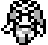
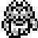

# Race


Remember that all values are inserted mirrored into the save file, for example:

`05` will be inserted into the save file as `05 50`


<table><thead><tr><th width="128">Hex Value</th><th width="76">Icon</th><th> Character</th></tr></thead><tbody><tr><td>B1</td><td></td><td>Human Male (Starter)</td></tr><tr><td>B2</td><td></td><td>Human Female (Starter)</td></tr><tr><td>B3</td><td></td><td>Mutant Male (Starter)</td></tr><tr><td>B4</td><td></td><td>Mutant Female (Starter)</td></tr><tr><td>12</td><td></td><td>Clipper</td></tr><tr><td>24</td><td></td><td>Redbull</td></tr><tr><td>48</td><td></td><td>Wererat</td></tr><tr><td>78</td><td></td><td>Zombie</td></tr><tr><td>AD</td><td></td><td>Human Male</td></tr><tr><td>AE</td><td></td><td>Human Female</td></tr><tr><td>AF</td><td></td><td>Mutant Male</td></tr><tr><td>B0</td><td></td><td>Mutant Female</td></tr><tr><td>42</td><td></td><td>Lizard</td></tr><tr><td>60</td><td></td><td>Skeleton</td></tr><tr><td>8A</td><td></td><td>Albatros</td></tr><tr><td>4E</td><td></td><td>Zombie</td></tr></tbody></table>
